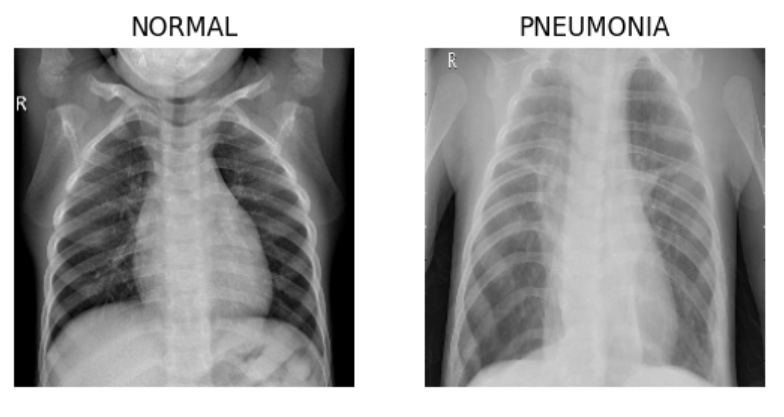

# PneumoNet: Deep Learning for Pneumonia Detection in Chest X-rays

PneumoNet is a pioneering deep learning project focused on harnessing the potential of neural networks for accurate and early pneumonia detection using chest X-ray images. By leveraging state-of-the-art machine learning techniques, our model analyzes medical images to distinguish between normal cases and those affected by pneumonia, contributing to enhanced patient outcomes and improved healthcare.

## Table of Contents

- [Features](#features)
- [Installation](#installation)
- [Usage](#usage)
- [Research Paper](#research-paper)
- [License](#license)
- [Contact](#contact)

## Features

- Advanced neural network architecture tailored for precise and reliable pneumonia detection.
- Utilizes a diverse and comprehensive dataset of chest X-ray images for training and evaluation.
- Early diagnosis potential aids in improving patient care and outcomes.

## Installation

1. Clone this repository: `git clone https://github.com/mominwaqas15/PneumoNet.git`
2. Navigate to the project directory: `cd PneumoNet`
3. Install the required dependencies: `pip install -r requirements.txt`

## Usage

1. Obtain chest X-ray images for analysis.
2. Run the PneumoNet model on your images.
3. Receive accurate and timely pneumonia detection results.

## Research Paper

I have attached a comprehensive research paper titled "PneumoNet: Deep Learning for Pneumonia Detection in Chest X-rays" in this repository. This paper delves deep into the challenges faced, methodologies employed to tackle these challenges, and presents detailed results of our model. You can access the paper [here](Research_Paper.pdf).

## License

This project is licensed under the [MIT License](LICENSE).

## Contact

For any inquiries or collaboration opportunities, please reach out to [Momin Waqas](https://github.com/mominwaqas15).
